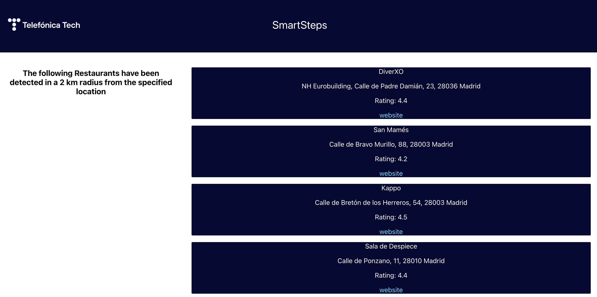

# React Frontend & Python Backend

The objective of this interview is to:

1. Load a JSON file with Python and send it via HTTP
2. Request the file from a React frontend
3. Build a "card" React class
4. Render one card per each element of the JSON data

## Files to change

* `backend/server.py`
* `frontend/Exercise.js`
* `frontend/Exercise.css` (optionally)

## Example

